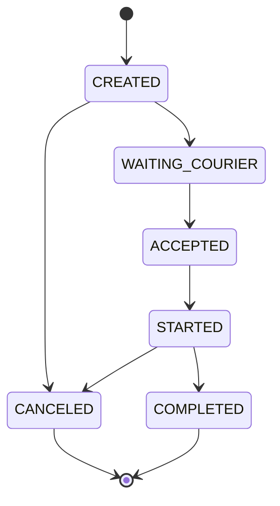

# Route Generator

Project for study purposes that will be used as event generator
for another service.

## Technologies
- Java 17
- SpringBoot
- Kafka + Spring Kafka

## Solution

The routes will be created by threads along with some Thread#sleep calls
to simulate the interval between each event until the route reach the last state `COMPLETED`.

There is a simple mechanism to do a rollback for the route status to
force a scenario of "delayed events" or "events out of order". As said before, for study purpose, 
it could be used for a scenario of a idempotent consumer. 

## Running

Run docker compose:
```shell
./docker-compose up -d
```

Start the application using the IDE or the command line below:
```
./gradlew bootRun
```

## Challenge
Create another Git repository with a Spring Boot project that should containing the following starters: Web, Data JPA, Spring for Kafka, Actuator, Test.

### Features

#### REST API
- Endpoint to get all completed routes
- Endpoint to get a single route events
- Endpoint to force pending routes conclusion
> Add the Swagger for those endpoints. Use the [Spring Doc](https://springdoc.org/)

#### Kafka Consumer
- Create a idempotent consumer for the topic `routes` at the broker localhost:9092 using
  - key serializer/deserializer: String
  - value serializer/deserializer: Json (it is available in the Spring for Kafka dependency) 

__Route Event__
```json
{
  "id":"41416ff1-5d1a-4b1e-a867-beb1ddc238d6",
  "originId":"68ace5a8-5a11-454a-8f26-44e7976d3eaf",
  "destinationId":"fc13851c-8f9e-4c02-8cd6-0dad03a8ee21",
  "courierId":"185257fd-2baf-4784-8c1a-7b33289bc135",
  "status":"STARTED",
  "eventTime":1701905881.325398
}
```

__Route FSM__


Create the _README.md_ file explaning how to run the project. Feel free to include any details you consider relevant.
